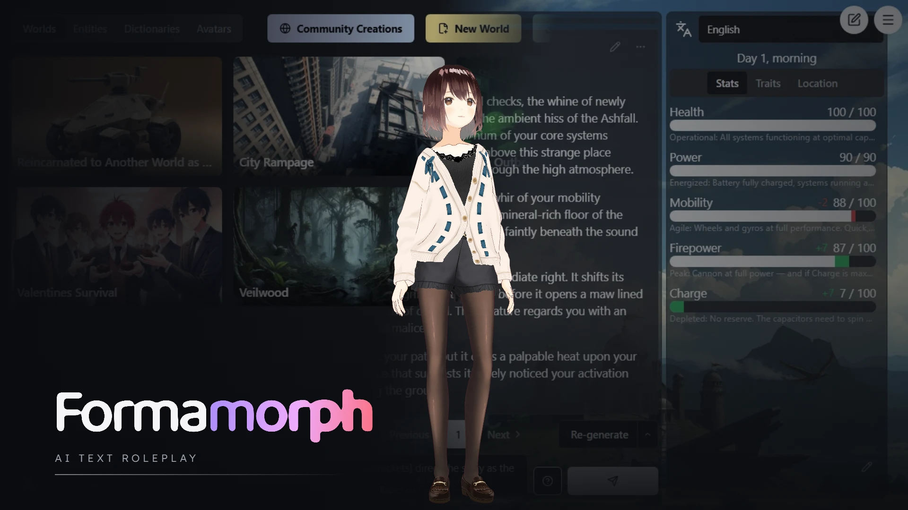

# 🧬 Formamorph

> A browser-based, AI-driven text RPG framework — **play**, **create**, and **share** interactive worlds powered by your own LLM.

> ▶️ **[Play in your browser →](https://jakejamesdev.github.io/formamorph/)** — instant, no install, runs fully client-side. *Please read the 18+ notice below first.*

> [!CAUTION]
> **For adults only (18+) — mature content.**
> Formamorph is an open-ended AI roleplay engine. Stories are generated by **your chosen AI model** and worlds can be authored by **anyone**, so the content is effectively unbounded and may include explicit sexual or other adult material. The in-app world browser surfaces **user-created worlds provided as-is and *not moderated*** by this project. The bundled example worlds and default avatar are kept clean, but that doesn't constrain what your model generates or what you import. See [Disclaimer & responsible use](#disclaimer) before using.

Formamorph runs entirely in the browser and talks to any **OpenAI-compatible** chat-completions endpoint (a local LM Studio / Ollama server, OpenAI, etc.), so your games stay on your own machine and model — or, in the **desktop app**, download and run a model **fully locally** with no endpoint setup at all. Pick a built-in world, import one, or build your own in the visual editor.

> ℹ️ This is a community fork of the original [Formamorph on itch.io](https://fierylion.itch.io/formamorph) by FieryLionite, rebuilt in TypeScript with feature parity as the goal.

---

## ✨ Features

- 🌍 **Worlds** — play bundled example worlds, import custom `.json` worlds, or author your own
- 🛠️ **World editor** — stats, entities, locations, traits, stat-updates, and a lore **dictionary**, all in a live editor
- 🎭 **Character customization** — recolor a **3D VRM avatar** in real time (hair, skin & eye color, hairstyle), plus any body morphs the model itself provides; bring your own `.vrm` or use the bundled one
- 🤖 **Bring your own AI** — any OpenAI-compatible chat-completions API; streaming responses
- 🧠 **Run a model locally (desktop)** — the desktop app can download and run a **GGUF** model on your own machine (a bundled **node-llama-cpp** engine serving a local endpoint), with a built-in model manager, VRAM-tier picker, and resumable downloads — no external API needed
- 🧮 **Dynamic stat code** — derive stats from others with sandboxed JS formulas (see the [Stat Code Guide](docs/StatCodeGuide.md))
- 🔊 **Audio** — in-browser text-to-speech (Kokoro), plus per-location ambient sound and background music
- 💾 **Saves** — multiple save slots with state rollback, stored locally in IndexedDB
- 📱 **Responsive** — three-panel desktop layout and a single-panel portrait/mobile mode
- 🖥️ **Runs in-browser or as a standalone desktop app** (Windows / macOS / Linux) — package a build with `npm run desktop:build` (see [Desktop build](#-desktop-build))
- 🏷️ **Discover & publish** — tag worlds and share them via an optional workshop backend (community content is **unmoderated** — see the [disclaimer](#disclaimer))

---

## 🚀 Getting started

**Prerequisites:** [Node.js](https://nodejs.org) 20.19+ and npm.

```bash
npm install
npm run dev      # serves at http://localhost:5173
```

Then open the app, head to **Settings**, and point it at your AI endpoint (or pre-seed it via `.env.local` — see below).

## 📜 Scripts

| Command | What it does |
|---|---|
| `npm run dev` | Start the Vite dev server (hot reload) |
| `npm run build` | Build the production bundle to `dist/` |
| `npm run preview` | Preview the production build locally |
| `npm run lint` | Run ESLint |
| `npm run typecheck` | Type-check with `tsc` (no emit) |
| `npm run desktop:dev` | Build, then launch the app in a desktop window (Electron) |
| `npm run desktop:build` | Package a standalone **Windows `.exe`** to `release/` |
| `npm run desktop:build:linux` | Package a Linux **AppImage** to `release/` |
| `npm run desktop:build:mac` | Package a macOS **dmg** to `release/` |

## 🖥️ Desktop build

Formamorph can run as a standalone desktop app — no browser needed. A thin [Electron](https://www.electronjs.org/) shell (`electron/`) loads the normal web build and bundles its own Chromium, so WebGPU TTS, 3D rendering, and IndexedDB saves all work exactly as in-browser. The desktop app also unlocks the **local model engine** — download and run a GGUF on your own machine (see the [Changelog](docs/Changelog.md)).

```bash
npm run desktop:build          # Windows portable .exe
npm run desktop:build:linux    # Linux AppImage
npm run desktop:build:mac      # macOS dmg
```

The Windows target produces a **portable** single-file executable at `release/Formamorph-<version>-portable.exe` (the `release/` folder is gitignored). Double-click it to run — no install step. For a quick dev run in a desktop window without packaging, use `npm run desktop:dev`. Tagging a `v*` release builds all three platforms in CI and attaches them (plus a `formamorph-web-<tag>.zip` browser build) to the GitHub Release.

> [!WARNING]
> **`EPERM: … rename 'release\win-unpacked.tmp'` on Windows?**
> This happens when **Windows Search** indexes the folder you're building in (the `Documents` tree is indexed by default). The indexer opens handles on the freshly-extracted Electron files right as the packager renames them.
>
> **Fix (one-time):** Control Panel → **Indexing Options** → **Modify** → uncheck this repo (or its `release/` folder). Excluding your whole `Documents\GitHub` is reasonable — source repos shouldn't be indexed anyway.
>
> **Or** build to a location outside the indexed tree:
> ```bash
> npx electron-builder --win portable -c.directories.output=D:/builds/formamorph
> ```

## ⚙️ Configuration

All configuration is **optional** — the app ships with working defaults, and the AI endpoint can be set in-app under **Settings**. To pre-seed values for local development, copy `.env.example` → `.env.local` (gitignored) and uncomment what you need:

| Variable | Purpose |
|---|---|
| `VITE_DEFAULT_ENDPOINT` | Full chat-completions URL (the app appends no path) |
| `VITE_DEFAULT_API_TOKEN` | API token for that endpoint |
| `VITE_DEFAULT_MODEL_NAME` | Default model name |
| `VITE_DEFAULT_CONTEXT_WINDOW` | Model context window in tokens (auto-detected from the endpoint when possible) |
| `VITE_DEFAULT_MAX_TOKENS` | Max tokens per AI response |
| `VITE_API_URL_DEV` | Workshop backend URL (worlds / auth) |

### 🌡️ Optional VRAM monitor

Text-to-speech (Kokoro) loads a model into your GPU. To see live VRAM usage and get a warning before loading TTS would exhaust it, run the optional helper next to the app:

```bash
npm run vram-helper   # serves at http://localhost:5179
```

Then open the in-game **Text to Speech** panel and confirm the **VRAM helper URL** field. Requires an **NVIDIA GPU** with `nvidia-smi` on your PATH. The helper is local-only; if you serve the app over **https**, browsers block it from reaching an `http://localhost` helper, so use it with the local dev server.

> ℹ️ Total/used/free VRAM (which drives the low-VRAM warning) always works. The **per-process** list often shows `N/A` — it needs an elevated (Administrator) terminal, and even then consumer GeForce cards in the default WDDM driver mode usually can't report it. That's an `nvidia-smi` limitation, not a bug.

---

## 🧱 Tech stack

**React 18** · **TypeScript** · **Vite 5** · **Tailwind CSS** + **shadcn/ui** (Radix) · **three.js** + **@pixiv/three-vrm** (3D avatars) · **Kokoro** (TTS) · **QuickJS** (sandboxed stat code)

## 📁 Project layout

```
docs/                Reference docs (WorldFormat, StatCodeGuide)
public/              Static assets (default VRM, animations, images)
src/
├── views/           Top-level screens (MainMenu, GameViewer, WorldEditor, …)
├── components/      shadcn UI primitives + game panels + modals
├── contexts/        React state (GameData, Gameplay, Settings)
├── managers/        World-editor panels (stats, entities, locations, …)
├── services/        Storage & auth (IndexedDB + optional backend)
├── lib/             Utilities, web workers, helpers
├── types/           Shared TypeScript domain types
└── defaultworlds/   Bundled example worlds
```

## 📚 Documentation

- 📐 [World Format](docs/WorldFormat.md) — the structure of a world `.json` file
- 🧮 [Stat Code Guide](docs/StatCodeGuide.md) — writing dynamic stat formulas

<a id="disclaimer"></a>

## ⚖️ Disclaimer & responsible use

- **For adults only.** By using Formamorph you confirm you are of legal age in your jurisdiction. It is intended solely for adult audiences.
- **You control the AI.** All narrative is generated by the third-party model/endpoint *you* configure. This project does not generate, host, or endorse that output, and is not responsible for what your model produces.
- **Community worlds are unmoderated.** Worlds discovered or imported through the in-app browser are **user-created and provided as-is — without review, moderation, or endorsement** by this project. Import and play them at your own risk.
- **No illegal content — zero tolerance.** You may not use Formamorph to create, request, or distribute content that is illegal in your jurisdiction. Sexual content involving minors is **strictly prohibited** under any circumstance.
- **Provided "as is."** No warranty of any kind; see the [LICENSE](LICENSE).

## 📄 License

Licensed under the **[PolyForm Noncommercial License 1.0.0](LICENSE)** © 2026 JakeJamesDev.

You're free to **use, modify, and share** Formamorph for any **noncommercial** purpose (personal use, hobby projects, research, and use by nonprofits/educational/government bodies all count). **Commercial use requires a separate license** — reach out if you need one.

This project is a fork of the original **[FieryLionite/formamorph](https://github.com/FieryLionite/formamorph)**, which is MIT-licensed. Portions derived from that work remain under MIT; that notice is preserved in **[legal/LICENSE-upstream-MIT.txt](legal/LICENSE-upstream-MIT.txt)**. Bundled third-party software and assets are credited in **[THIRD-PARTY-NOTICES.md](THIRD-PARTY-NOTICES.md)**.

> ℹ️ "Noncommercial source-available," not OSI "open source" — the difference is the commercial-use restriction.

## 🤝 Contributing

Contributions are welcome — see **[CONTRIBUTING.md](CONTRIBUTING.md)**. Because Formamorph also ships commercial builds, contributions require agreeing to the **[Contributor License Agreement](CLA.md)**.
